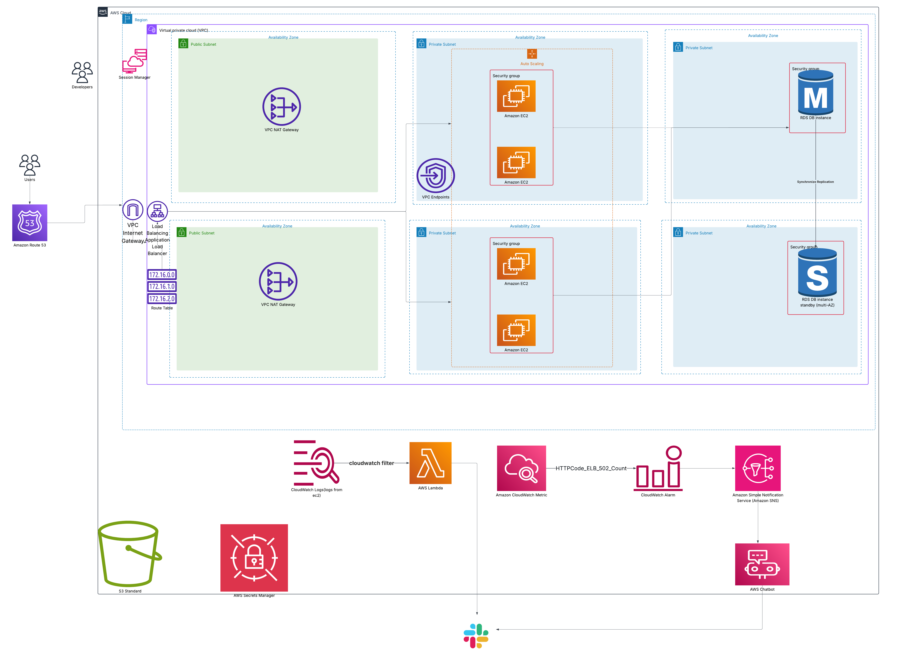

# Scalable Web Application with ALB and Auto Scaling

This document outlines the cloud architecture for the **Scalable Web Application with ALB and Auto Scaling**, implemented using core AWS services to ensure high availability, scalability, and secure operations. This solution does not include AWS CDK or CloudFormation templates.

---

## Table of Contents

* [Solution Overview](#solution-overview)
* [Architecture Diagram](#architecture-diagram)
* [Key Components](#key-components)

  * [Networking](#networking)
  * [Compute](#compute)
  * [Database](#database)
  * [Access & Security](#access--security)
  * [Monitoring & Alerts](#monitoring--alerts)
  * [Storage](#storage)
* [IAM Roles](#iam-roles)
* [Submission Notes](#submission-notes)
* [License](#license)

---

## Solution Overview

This solution supports a secure, auto-scalable backend environment for processing survey responses and receipt uploads. It includes an Application Load Balancer with EC2 instances behind private subnets, connected to a highly available multi-AZ RDS database. The system uses CloudWatch for logging, Lambda for alert handling, and Slack for notifications.

---

## Architecture Diagram

---

## Key Components

### Networking

* **VPC** with multiple public and private subnets across two Availability Zones.
* **Internet Gateway (IGW)** attached to the VPC for public access.
* **Two NAT Gateways**, each in a public subnet, allow private subnets to reach the internet.
* **Route Tables** manage routing between subnets and gateways.
* **VPC Endpoints** enable private access to AWS services like S3.

### Compute

* **Application Load Balancer (ALB):** Receives incoming traffic from **Route 53** and forwards it to a target **Auto Scaling Group (ASG)**.
* **EC2 Instances:** Hosted in **private subnets**, serving application logic securely.
* **Auto Scaling Policy:**

  * The ASG is configured with a **target tracking scaling policy** based on the **ALB RequestCountPerTarget metric**.
  * When the average number of requests per EC2 instance exceeds the threshold (e.g., 1000 requests per minute), additional instances are launched.
  * Instances are terminated when demand drops below the threshold, ensuring cost-efficiency and responsiveness to load changes.

### Database

* **Amazon RDS** (PostgreSQL or MySQL) with **multi-AZ failover** for high availability.
* RDS is in private subnets and accepts traffic only from the EC2 subnet via **Security Groups**.

### Access & Security

* **Security Groups** are tightly scoped:

  * ALB allows inbound HTTP/HTTPS.
  * EC2 instances allow access only from the ALB.
  * RDS allows access only from EC2 instances.
* **Secrets Manager** securely stores the RDS credentials.
* **Session Manager (SSM)** provides developers shell access to EC2 instances in private subnets without requiring SSH or bastion hosts.

### Monitoring & Alerts

* **CloudWatch Logs** capture EC2 logs.
* A **log subscription filter** triggers a **Lambda function** on error logs, which sends alerts to **Slack via webhook**.
* A **CloudWatch Alarm** tracks ALB 502 errors and notifies an **SNS topic**, which then relays alerts via **AWS Chatbot** to **Slack**.

### Storage

* **Amazon S3** stores static assets and uploaded content like receipts.

---

## IAM Roles

EC2 instances are assigned a custom **IAM Role** that grants:

* Read-only access to **Secrets Manager** for fetching DB credentials.
* Access to **CloudWatch Logs** for log publishing.
* Access to **SSM Agent** for Session Manager connections.
* Limited access to **S3** for file uploads or downloads if needed.

